# GitOps Configuration Management with ArgoCD

## Overview

This project demonstrates advanced GitOps configuration management using **ArgoCD**, integrating **Helm**, **Kustomize**, and **external secret managers** like **Vault** and **AWS Secrets Manager**. It showcases best practices for secure, declarative Kubernetes application deployment.

---


## Project Structure

```bash
.
├── helm-app/
│   ├── Chart.yaml
│   ├── values.yaml
│   └── templates/
│       ├── deployment.yaml
│       ├── service.yaml
│       └── ingress.yaml
├── kustomize-app/
│   ├── base/
│   │   ├── kustomization.yaml
│   │   └── deployment.yaml
│   └── overlays/
│       ├── dev/
│       │   ├── kustomization.yaml
│       │   └── patch.yaml
│       └── prod/
│           ├── kustomization.yaml
│           └── patch.yaml
└── README.md
```

----

## Objectives
- Integrate **Helm** charts with ArgoCD

- Manage environments with **Kustomize overlays**

- Secure secrets using **Kubernetes, Vault,** and **AWS Secrets Manager**

- Customize **resource management** and **sync policies** in ArgoCD


---


## Prerequisites

- **kubectl:** Kubernetes command-line tool.
- **Helm:** Package manager for Kubernetes.
- **ArgoCD CLI:** For managing ArgoCD.
- **HashiCorp Vault:** For secrets management.
- **AWS CLI:** For AWS Secrets Manager integration.
- **Git:** For version control.
- **A Kubernetes cluster:** Minikube, Kind, or a cloud-based cluster like EKS.
- **A Git repository:** Hosted on GitHub, GitLab, or Bitbucket.


---

## Verify Installed Tools

Ensure the following tools are installed:

```bash
helm version
kubectl version --client
kustomize version
vault -v
aws --version
git --version
argocd version --client
```
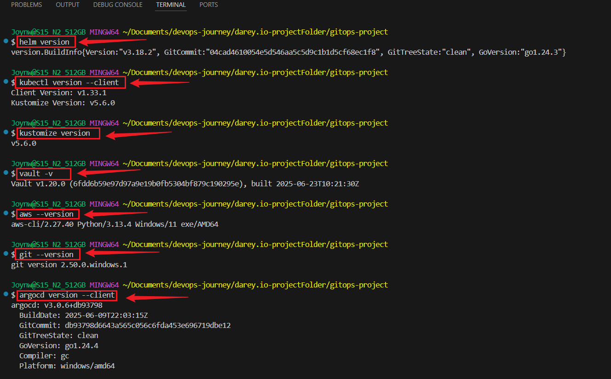


---


## 1: Managing Configurations with Helm and Kustomize in ArgoCD

### 1.1: Set Up a Git Repository
- Create a Git repository to store your Helm charts and Kustomize configurations.

```bash
mkdir gitops-mini-project
cd gitops-mini-project
git init
touch .gitignore
echo "vault_token.txt" >> .gitignore
git add .gitignore
git commit -m "Initial commit"
```

---

## 1.2: Create a Helm Chart

- Create a Helm chart for a simple application (e.g., a basic Nginx deployment).

```bash
cd my-app
helm create my-app
```


### Edit `my-app/Chart.yaml` to set metadata:

```bash
apiVersion: v2
name: my-app
description: A simple Nginx application
version: 0.1.0
appVersion: "1.16.0"
```


### Edit `my-app/values.yaml` to define default values:
```bash
replicaCount: 1
image:
  repository: nginx
  pullPolicy: IfNotPresent
  tag: "latest"
service:
  type: ClusterIP
  port: 80
ingress:
  enabled: false
  className: ""
  annotations: {}
  hosts:
    - host: chart-example.local
      paths:
        - path: /
          pathType: ImplementationSpecific
  tls: []
autoscaling:
  enabled: false
  minReplicas: 1
  maxReplicas: 3
  targetCPUUtilizationPercentage: 80
serviceAccount:
  create: false
  annotations: {}
  name: ""
```


---


## 1.3: Deploy Helm Chart via ArgoCD

### Start Minikube and Check Cluster health

```bash
minikube start
minikube status
kubectl get nodes
kubectl cluster-info
```


### Set Up ArgoCD
- Install ArgoCD:
```bash
kubectl create namespace argocd
helm repo add argo https://argoproj.github.io/argo-helm
helm install argocd argo/argo-cd --namespace argocd 
```
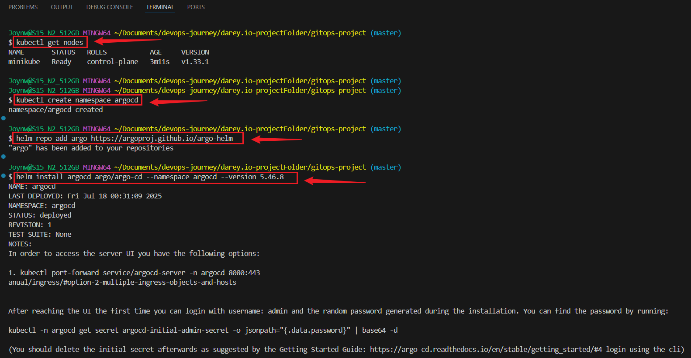


### Verify ArgoCD Installation:
```bash
kubectl get pods -n argocd
```


### Access ArgoCD UI:

- Get ArgoCD Admin Password and set up port-forwarding:
```bash
kubectl -n argocd get secret argocd-initial-admin-secret -o jsonpath="{.data.password}" | base64 -d
echo "ArgoCD Admin Password: $INITIAL_PASSWORD"
```


### Sync the ArgoCD Application

- Access ArgoCD UI:
```bash
kubectl port-forward svc/argocd-server -n argocd 8080:443
```

- Open `https://localhost:8080` in a browser, log in with username `admin` and the password from above.


### Deploy Helm Chart via ArgoCD

- Create ArgoCD Application for Helm: 

- Create a file `helm-app.yaml`:
```bash
apiVersion: argoproj.io/v1alpha1
kind: Application
metadata:
  name: my-app-helm
  namespace: argocd
spec:
  project: default
  source:
    repoURL: https://github.com/your-username/gitops-mini-project.git
    targetRevision: main
    path: my-app
    helm:
      valueFiles:
      - values.yaml
  destination:
    server: https://kubernetes.default.svc
    namespace: default
  syncPolicy:
    automated:
      prune: true
      selfHeal: true
```      


### Apply the application:
```bash
kubectl apply -f helm-app.yaml
```
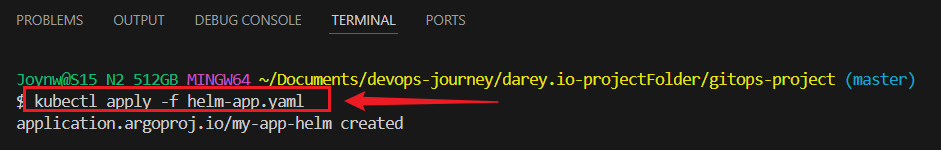


### Test Helm Chart Locally:
```bash
helm lint .
```

### Push to GitHub
```bash
git add .
git commit -m "new update"
git branch -M main
git remote add origin https://github.com/your-username/gitops-project.git
git push -u origin main
```


### Verify Deployment:

- In the ArgoCD UI, click the SYNC button for my-app-helm.


- Or Login via CLI
```bash
kubectl -n argocd get secret argocd-initial-admin-secret -o jsonpath="{.data.password}" | base64 -d
argocd login localhost:8080 --username admin --password <password-from-above>
kubectl port-forward svc/argocd-server -n argocd 8080:443
kubectl get pods,svc -n default
kubectl get pods -n argocd
argocd app sync my-app-helm
argocd app get my-app-helm
```

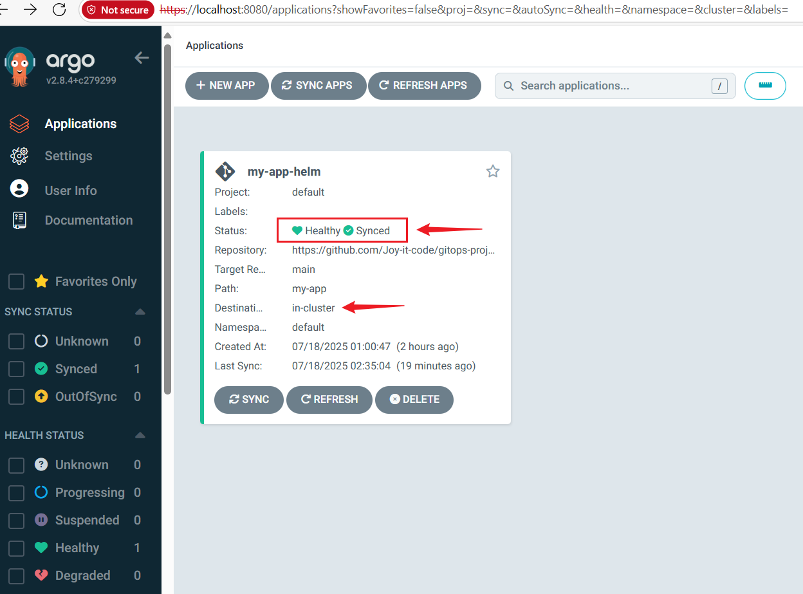
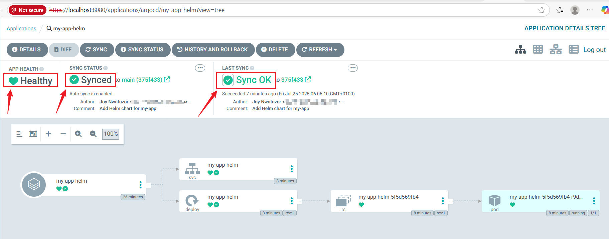


### Test Helm Deployment:
```bash
kubectl get pods -n default
kubectl get svc -n default
argocd app get my-app-helm
```
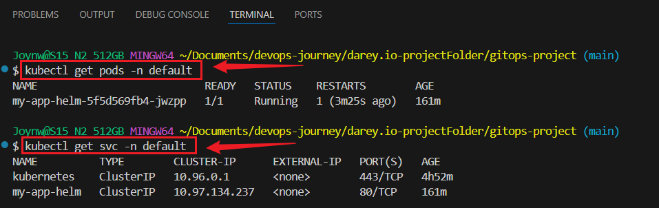


---

## 2: Utilizing `Kustomize` in ArgoCD

### Create Kustomize directory structure:
```bash
cd gitops-project
mkdir -p my-app-kustomize/base
mkdir -p my-app-kustomize/overlays/dev
mkdir -p my-app-kustomize/overlays/prod
```

### Create a `Kustomize base` and `overlays` for environment-specific configurations.

### 2.1: Create `Base` Configuration
```bash
mkdir -p my-app/base
```

### Create `my-app-kustomize/base/deployment.yaml`:

```bash
apiVersion: apps/v1
kind: Deployment
metadata:
  name: my-app
  namespace: default
spec:
  replicas: 1
  selector:
    matchLabels:
      app: my-app
  template:
    metadata:
      labels:
        app: my-app
    spec:
      containers:
      - name: nginx
        image: nginx:latest
        ports:
        - containerPort: 80
```        


### Create `my-app-kustomize/base/service.yaml`:

```bash
apiVersion: v1
kind: Service
metadata:
  name: my-app
  namespace: default
spec:
  selector:
    app: my-app
  ports:
  - port: 80
    targetPort: 80
  type: ClusterIP
```


### Create `my-app-kustomize/base/kustomization.yaml`:
```bash
apiVersion: kustomize.config.k8s.io/v1beta1
kind: Kustomization
resources:
- deployment.yaml
- service.yaml
```


## 2.2: Create `Dev Overlay`

```bash
mkdir -p my-app/overlays/dev
```

### Create `my-app-kustomize/overlays/dev/patch.yaml`:

```bash
apiVersion: apps/v1
kind: Deployment
metadata:
  name: my-app
spec:
  replicas: 2

```


### Create `my-app-kustomize/overlays/dev/kustomization.yaml`:
```bash
apiVersion: kustomize.config.k8s.io/v1beta1
kind: Kustomization
bases:
- ../../base
patchesStrategicMerge:
- patch.yaml
```


### Create `Prod Overlay`:
```bash
mkdir -p my-app/overlays/prod
```

### Create `my-app/overlays/prod/patch.yaml`:

```bash
apiVersion: apps/v1
kind: Deployment
metadata:
  name: my-app
spec:
  replicas: 3
```


### Create `my-app/overlays/prod/kustomization.yaml`:

```bash
apiVersion: kustomize.config.k8s.io/v1beta1
kind: Kustomization
bases:
- ../../base
patchesStrategicMerge:
- patch.yaml
```


### Commit Kustomize Configurations:

```bash
cd my-app-kustomize/base
kustomize build .
git add my-app/base my-app/overlays
git commit -m "Add Kustomize base and overlays"
git push origin main
```


### Create `my-app/overlays/dev/deployment-patch.yaml`
```bash
apiVersion: apps/v1
kind: Deployment
metadata:
  name: my-app
spec:
  replicas: 2
  template:
    metadata:
      labels:
        app: my-app
    spec:
      containers:
      - name: nginx
        image: nginx:latest
        ports:
        - containerPort: 80
```

### Test Configuration Locally
```bash
cd my-app/overlays/dev
kustomize build .
```

### Commit Kustomize Configurations:
```bash
git add .
git commit -m "Add Kustomize base and overlays"
git push origin main
```


---


## 3: Deploy Kustomize via ArgoCD

- Create an ArgoCD application for the `dev overlay`:
```bash
touch kustomize-app-dev.yaml
```
```bash
apiVersion: argoproj.io/v1alpha1
kind: Application
metadata:
  name: my-app-kustomize-dev
  namespace: argocd
spec:
  project: default
  source:
    repoURL: <your-git-repo-url>
    targetRevision: main
    path: my-app/overlays/dev
  destination:
    server: https://kubernetes.default.svc
    namespace: dev
  syncPolicy:
    automated:
      prune: true
      selfHeal: true
```      

### Apply the application for `dev`:

```bash
cd my-app/overlays/dev
kubectl apply -f kustomize-dev-app.yaml
kubectl create namespace dev
```
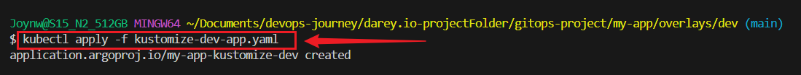

**Push to github**


### Verify and Sync the dev Application


- Access ArgoCD UI:
```bash
kubectl port-forward --address 0.0.0.0 svc/argocd-server -n argocd 8080:443
```

- Open `https://localhost:8080` on Browser
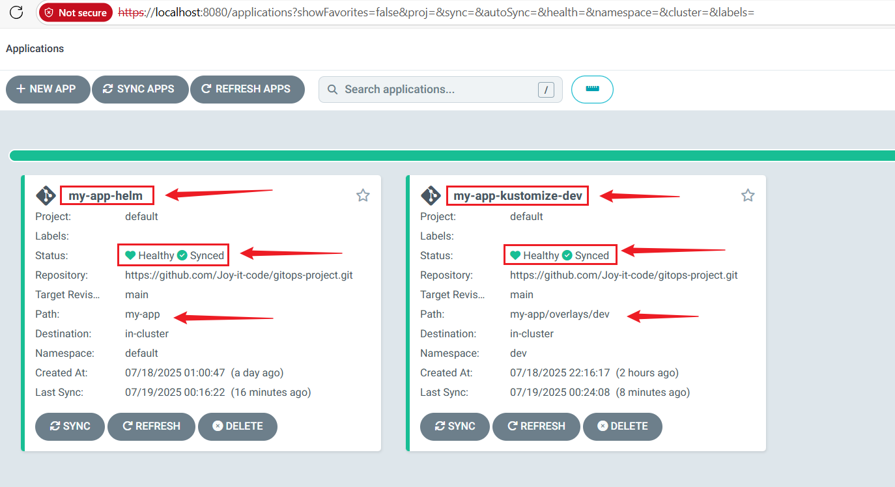
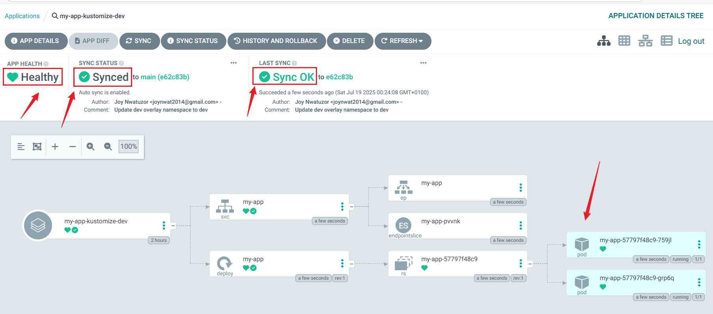


### Test Kustomize Deployment:
```bash
kubectl get pods -n dev
kubectl get svc -n dev
argocd app get my-app-kustomize-dev
```
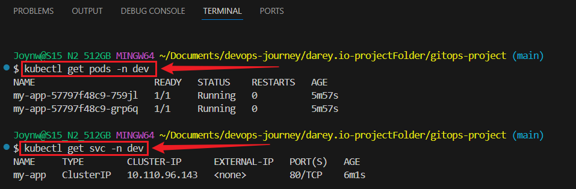


### Create and Apply the `prod` Application Manifest
```bash
cd gitops-project
touch kustomize-prod-app.yaml
```

### Paste:
```bash
apiVersion: argoproj.io/v1alpha1
kind: Application
metadata:
  name: my-app-kustomize-prod  
  namespace: argocd
spec:
  project: default
  source:
    repoURL: https://github.com/Joy-it-code/gitops-project.git  
    path: my-app/overlays/prod    
    targetRevision: main
  destination:
    server: https://kubernetes.default.svc
    namespace: production        
  syncPolicy:
    automated:
      prune: true
      selfHeal: true
```      


### Apply the manifest:
```bash
kubectl apply -f kustomize-prod-app.yaml
```

### Create the production Namespace
```bash
kubectl create namespace production
```

### Verify:
```bash
kubectl get namespaces
```
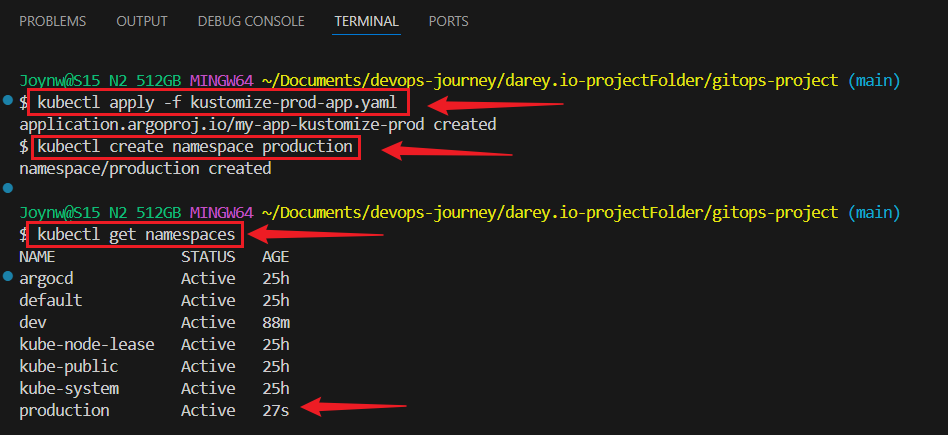


### Push to GitHub
```bash
git add .
git commit -m "kustomization app"
git push
```


### Sync the `prod` Application via UI or CLI
```bash
kubectl port-forward --address 0.0.0.0 svc/argocd-server -n argocd 8080:443
```
**Open `https://localhost:8080` in your browser.**

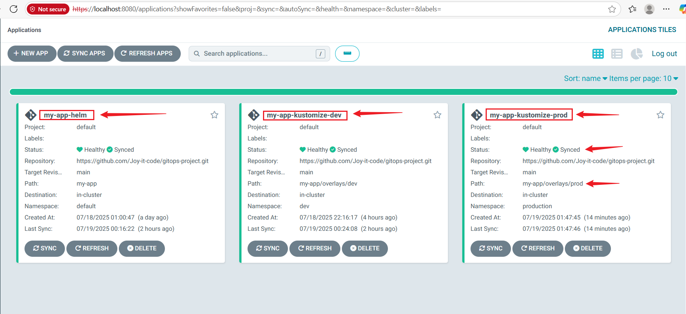
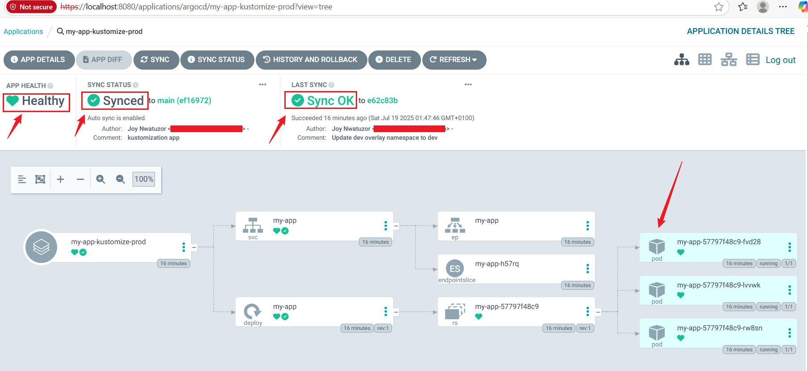


### Verify the `prod` Deployment

- Check pods and services:
```bash
kubectl get pods -n production  
kubectl get svc -n production  
```
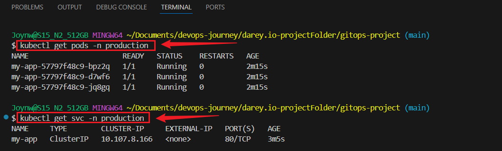


## 4: Secrets Management and Best Practices in ArgoCD

## Create a Kubernetes Secret:
```bash
kubectl create secret generic my-secret --from-literal=password=mypassword -n default
```

### Reference Secret in a Pod: 
- Create `pod.yaml`:
```bash
apiVersion: v1
kind: Pod
metadata:
  name: my-pod
  namespace: default
spec:
  containers:
  - name: nginx
    image: nginx:latest
    env:
    - name: MY_PASSWORD
      valueFrom:
        secretKeyRef:
          name: my-secret
          key: password
```

### Apply and test:

```bash
kubectl apply -f pod.yaml
kubectl describe pod my-pod -n default
```
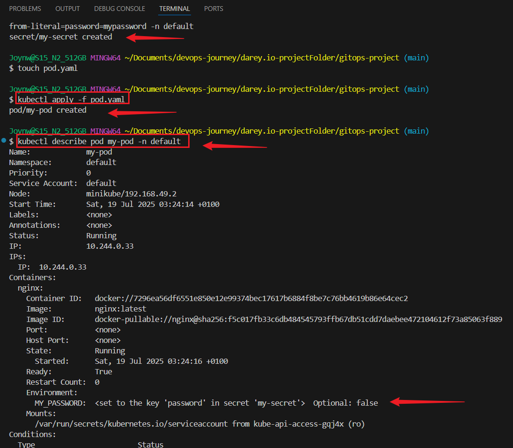


### Verify the Pod:
```bash
kubectl exec -it my-pod -n default -- /bin/sh
echo $MY_PASSWORD
```
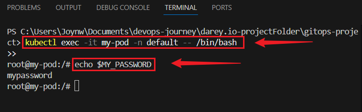


## Test the Nginx service
```bash
kubectl port-forward pod/my-pod -n default 8080:80
```
**Open `http://localhost:8080` in your browser**
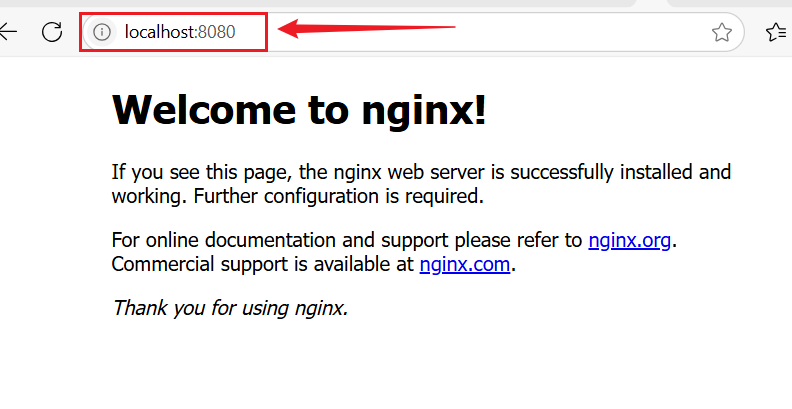


## 5: Integrate HashiCorp Vault
### Install Vault:

```bash
helm repo add hashicorp https://helm.releases.hashicorp.com
helm install vault hashicorp/vault --namespace vault --create-namespace --set "server.dev.enabled=true"
kubectl create namespace vault
```
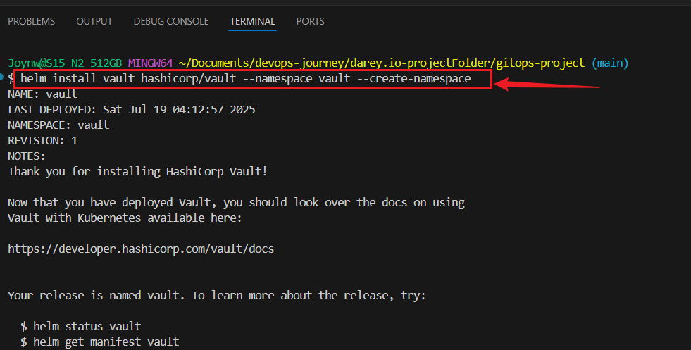


## Install the Vault Helm Chart
```bash
helm repo update
```


## Install the Vault chart in the vault namespace:
```bash
helm install vault hashicorp/vault --namespace vault --create-namespace
```

### Verify the Deployment:
Check pods
```bash
kubectl get pods -n vault
kubectl get svc -n vault
vault status
```


### Port-forward to the Vault service
- Forward the Vault service port to your local machine:
```bash
kubectl port-forward svc/vault 8200:8200 -n vault
```


### Set the Vault address and Check Status
- Set the VAULT_ADDR environment variable based on the port-forward:
```bash
export VAULT_ADDR=http://127.0.0.1:8200
```

### Verify Port-Forwarding
- Test the connection:
```bash
curl http://127.0.0.1:8200
```


## Store a Secret in Vault:

### Initialize Vault
```bash
vault operator init
```


### Unsealing Vault

```bash
vault operator unseal
vault status
```
**Enter one unseal key when prompted. Repeat 3 times, each with a different unseal key:**


### Log In with Root Token
```bash
vault login token=root 
```


### Test Vault Functionality
```bash
vault secrets enable -path=secret kv-v2
vault kv put secret/my-app password=mypassword
vault kv get secret/my-app
vault status
vault secrets list
```
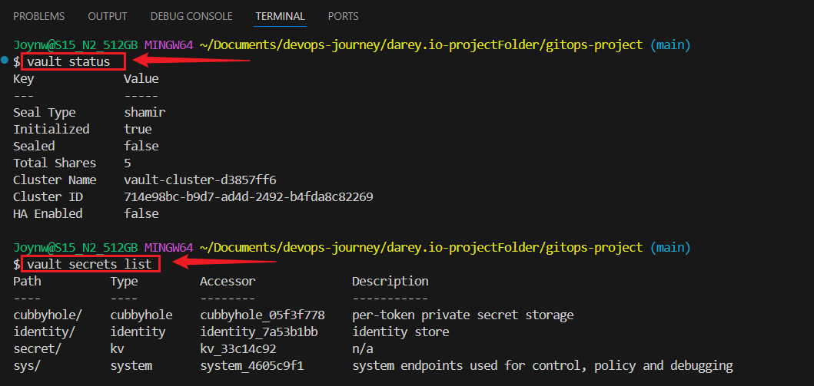


### Configure Vault Policies

- Create a policy for restricted access (e.g., read-only for `secret/my-app`)

```bash
echo 'path "secret/data/my-app" { capabilities = ["read"] }' > policy.hcl
vault policy write my-app-policy policy.hcl
```

### Create and Save token with this policy and :
```bash
vault token create -policy=my-app-policy -format=json
export VAULT_TOKEN=$(echo "$(vault token create -policy=my-app-policy -format=json)" | jq -r .auth.client_token)
echo $VAULT_TOKEN
```

### Test the Token
```bash
vault kv get secret/my-app
```


### Verify argocd-vault-plugin:
```bash
wsl -d Ubuntu
jq --version
argocd-vault-plugin --version
```
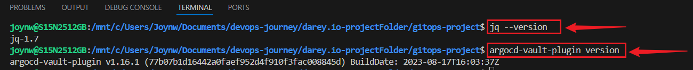


### Configure Vault 
```bash
kubectl port-forward svc/vault 0.0.0.0:8200:8200 -n vault
```


### Set Environment Variables:
```bash
export VAULT_ADDR=http://127.0.0.1:8200
echo $VAULT_ADDR
vault operator unseal <unseal-key-1>
vault operator unseal <unseal-key-2>
vault operator unseal <unseal-key-3>
vault login <token>
```


### Test Vault Access:
```bash
vault kv get secret/my-app
```
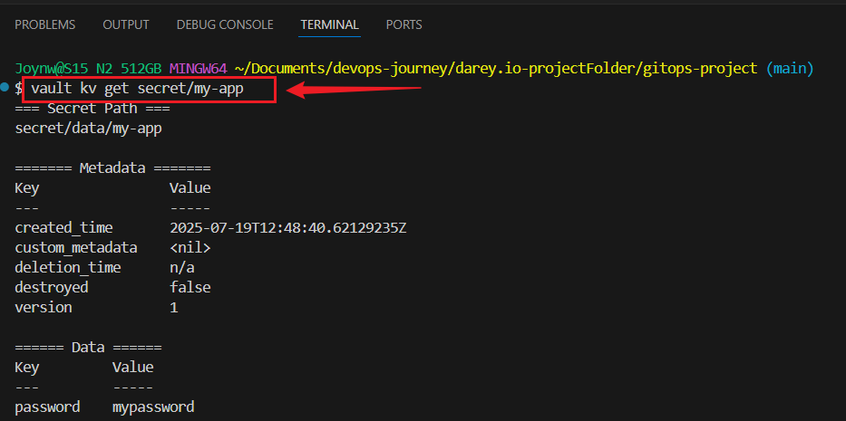


### Configure ArgoCD:
```bash
kubectl edit configmap argocd-cm -n argocd
```

### Add under data:
```bash
configManagementPlugins: |
  - name: vault-plugin
    init:
      command: [sh, -c]
      args: ["argocd-vault-plugin generate ./"]
    generate:
      command: [sh, -c]
      args: ["argocd-vault-plugin generate ./"]
kustomize.buildOptions: "--enable_alpha_plugins"      
```      
**Save and Exit**

### Apply
```bash
kubectl apply -f argocd-cm-latest.yaml
```


### Update Manifests:

- Create vault-secrets.yaml:
```bash
nano my-app/overlays/dev/vault-secrets.yaml
```

### Paste:
```bash
apiVersion: v1
kind: Secret
metadata:
  name: my-app-secret
  namespace: dev
type: Opaque
stringData:
  password: "{{ .Values.vault.secret.my-app.password }}"
```  
**Save (`Ctrl+O`, Enter, `Ctrl+X`).**


### Set Environment Variable and Login
```bash
export VAULT_ADDR=http://127.0.0.1:8200
vault operator unseal <unseal-key-1>
vault operator unseal <unseal-key-2>
vault operator unseal <unseal-key-3>
vault login <token>
```


### Check pod and Test Secret Access:
```bash
kubectl get pods -n vault -w
vault kv get secret/my-app
```
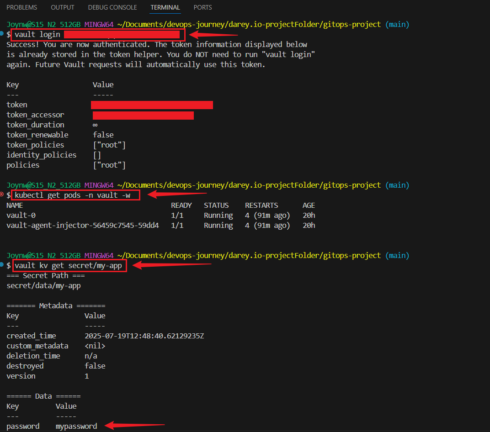


### Update kustomization.yaml:
```bash
nano my-app/overlays/dev/kustomization.yaml
```

### Edit
```bash
apiVersion: kustomize.config.k8s.io/v1beta1
kind: Kustomization
namespace: dev
resources:
- ../../base
- vault-secrets.yaml
generators:
- vault-generator.yaml
```


### Create vault-secrets.yaml

```bash
nano my-app/overlays/dev/vault-secrets.yaml
```

### Paste:
```bash
apiVersion: v1
kind: Secret
metadata:
  name: my-app-secret
  namespace: dev
type: Opaque
stringData:
  password: "{{ .Values.vault.secret.my-app.password }}"
```


### Create vault-generator.yaml:
```bash
nano my-app/overlays/dev/vault-generator.yaml
```

### Paste
```bash
apiVersion: argoproj.io/v1alpha1
kind: Application
metadata:
  name: vault-generator
  namespace: argocd
spec:
  project: default
  source:
    repoURL: https://github.com/username/gitops-project.git
    path: my-app/overlays/dev
    plugin:
      name: vault-plugin
      env:
      - name: VAULT_ADDR
        value: http://127.0.0.1:8200
      - name: VAULT_ROLE
        value: my-app-role
      - name: VAULT_AUTH_METHOD
        value: token
      - name: VAULT_TOKEN
        value: $VAULT_TOKEN
  destination:
    server: https://kubernetes.default.svc
    namespace: dev
  syncPolicy:
    automated:
      prune: true
      selfHeal: true
```

### Enable External Plugins in ArgoCD
```bash
kubectl edit configmap argocd-cm -n argocd
```


### Under data, add or verify the following
```bash
kustomize.buildOptions: "--enable_alpha_plugins"
```


### Commit and Push
```bash
git add my-app/overlays/dev/vault-secrets.yaml my-app/overlays/dev/kustomization.yaml my-app/overlays/dev/vault-generator.yaml
git commit -m "Add Vault integration for dev"
git push origin main
```

### Sync via ArgoCD UI
```bash
 kubectl port-forward svc/argocd-server 8080:80 -n argocd
```
- Open `http://localhost:8080`, log in with `admin / password`.
- Sync `vault-generator`, and monitor until `Synced` and `Healthy`.

### Verify

- Check the secret:
```bash
kubectl get secret my-app-secret -n dev -o yaml
```