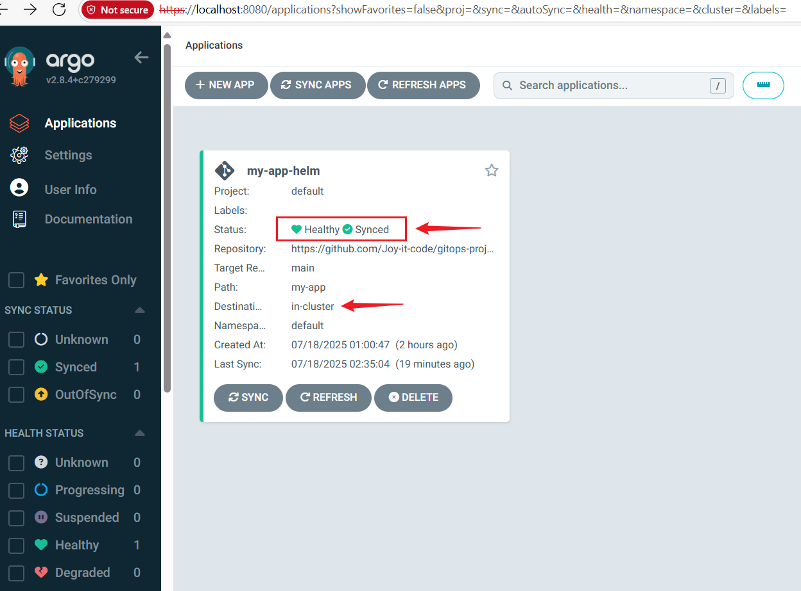
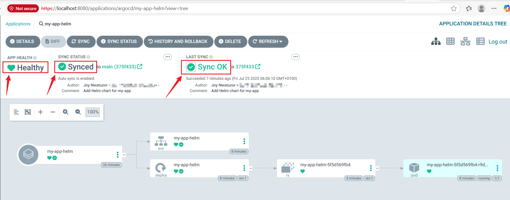
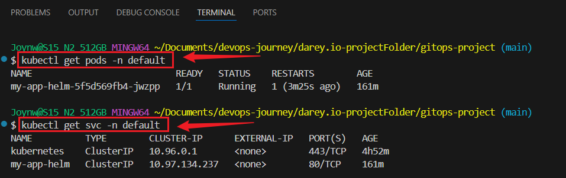
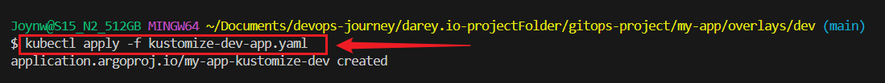
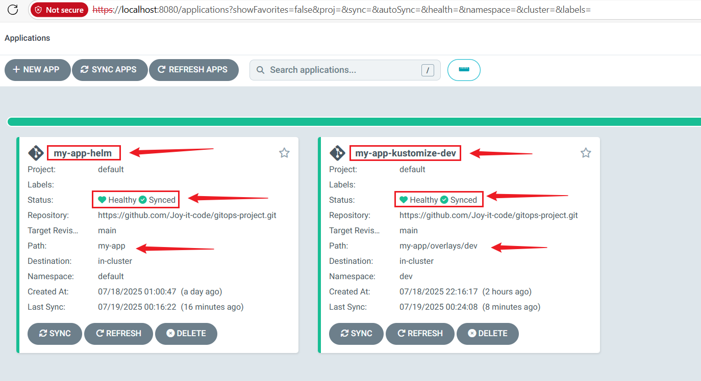
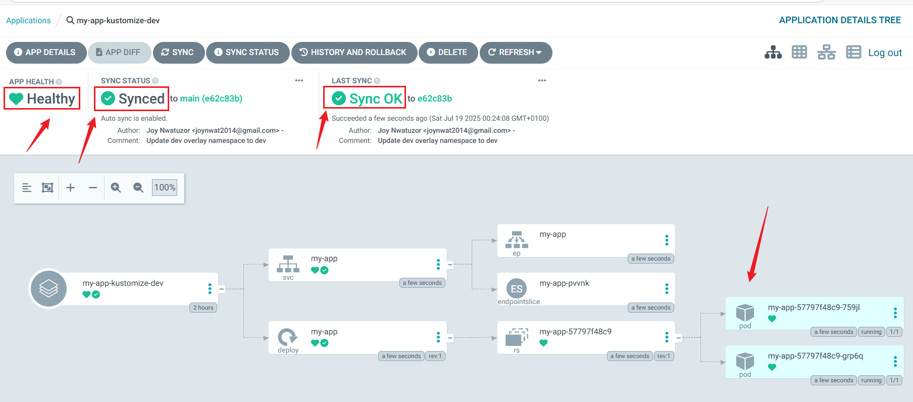
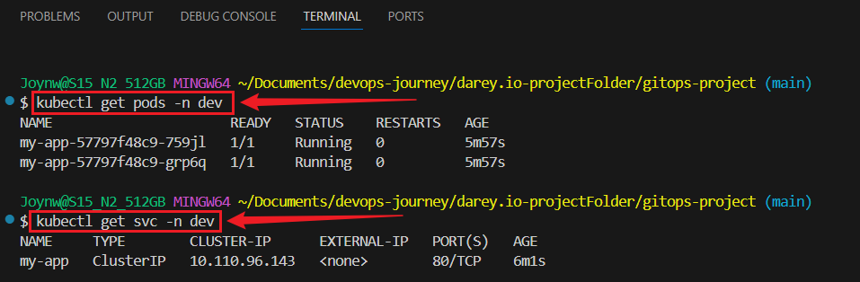
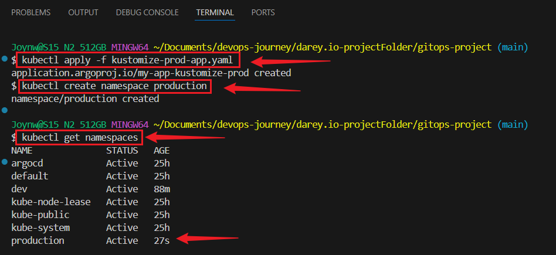

# GitOps Configuration Management with ArgoCD

## Overview

This project demonstrates advanced GitOps configuration management using **ArgoCD**, integrating **Helm**, **Kustomize**, and **external secret managers** like **Vault** and **AWS Secrets Manager**. It showcases best practices for secure, declarative Kubernetes application deployment.

---


## Project Structure

```bash
.
├── helm-app/
│   ├── Chart.yaml
│   ├── values.yaml
│   └── templates/
│       ├── deployment.yaml
│       ├── service.yaml
│       └── ingress.yaml
├── kustomize-app/
│   ├── base/
│   │   ├── kustomization.yaml
│   │   └── deployment.yaml
│   └── overlays/
│       ├── dev/
│       │   ├── kustomization.yaml
│       │   └── patch.yaml
│       └── prod/
│           ├── kustomization.yaml
│           └── patch.yaml
└── README.md
```

----

## Objectives
- Integrate **Helm** charts with ArgoCD

- Manage environments with **Kustomize overlays**

- Secure secrets using **Kubernetes, Vault,** and **AWS Secrets Manager**

- Customize **resource management** and **sync policies** in ArgoCD


---


## Prerequisites

- **kubectl:** Kubernetes command-line tool.
- **Helm:** Package manager for Kubernetes.
- **ArgoCD CLI:** For managing ArgoCD.
- **HashiCorp Vault:** For secrets management.
- **AWS CLI:** For AWS Secrets Manager integration.
- **Git:** For version control.
- **A Kubernetes cluster:** Minikube, Kind, or a cloud-based cluster like EKS.
- **A Git repository:** Hosted on GitHub, GitLab, or Bitbucket.


---

## Verify Installed Tools

Ensure the following tools are installed:

```bash
helm version
kubectl version --client
kustomize version
vault -v
aws --version
git --version
argocd version --client
```


---


## 1: Managing Configurations with Helm and Kustomize in ArgoCD

### 1.1: Set Up a Git Repository
- Create a Git repository to store your Helm charts and Kustomize configurations.

```bash
mkdir gitops-mini-project
cd gitops-mini-project
git init
touch .gitignore
echo "vault_token.txt" >> .gitignore
git add .gitignore
git commit -m "Initial commit"
```

---

## 1.2: Create a Helm Chart

- Create a Helm chart for a simple application (e.g., a basic Nginx deployment).

```bash
helm create my-app
```

### Edit `my-app/Chart.yaml` to set metadata:

```bash
apiVersion: v2
name: my-app
description: A simple Nginx application
version: 0.1.0
appVersion: "1.16.0"
```


### Edit `my-app/values.yaml` to define default values:
```bash
replicaCount: 1
image:
  repository: nginx
  tag: "latest"
  pullPolicy: IfNotPresent
service:
  type: ClusterIP
  port: 80
ingress:
  enabled: false  
  annotations: {}
  hosts:
    - host: chart-example.local
      paths: []
  tls: []
autoscaling:
  enabled: 
  minReplicas: 1
  maxReplicas: 10
  targetCPUUtilizationPercentage: 80
serviceAccount:
  create: false 
  annotations: {}
  name: ""
```

### Remove Unused Templates
```bash
rm my-app/templates/serviceaccount.yaml my-app/templates/hpa.yaml my-app/templates/tests/test-connection.yaml
```


## 1.3: Deploy Helm Chart via ArgoCD

### Start Minikube and Check Cluster health

```bash
minikube start
minikube status
kubectl get nodes
```


### Set Up ArgoCD
- Install ArgoCD:
```bash
kubectl create namespace argocd
helm repo add argo https://argoproj.github.io/argo-helm
helm install argocd argo/argo-cd --namespace argocd --version 5.46.8
```


### Get ArgoCD Admin Password:
```bash
INITIAL_PASSWORD=$(kubectl -n argocd get secret argocd-initial-admin-secret -o jsonpath="{.data.password}" | base64 -d)
echo "ArgoCD Admin Password: $INITIAL_PASSWORD"
```


### Sync the ArgoCD Application

- Access ArgoCD UI:
```bash
kubectl port-forward svc/argocd-server -n argocd 8080:443
```

- Open `https://localhost:8080` in a browser, log in with username `admin` and the password from above.


### Create ArgoCD Application for Helm: 

- Create a file `helm-app.yaml`:
```bash
apiVersion: argoproj.io/v1alpha1
kind: Application
metadata:
  name: my-app-helm
  namespace: argocd
spec:
  project: default
  source:
    repoURL: https://github.com/your-username/gitops-mini-project.git
    targetRevision: main
    path: my-app
    helm:
      valueFiles:
      - values.yaml
  destination:
    server: https://kubernetes.default.svc
    namespace: default
  syncPolicy:
    automated:
      prune: true
      selfHeal: true
```      


### Apply the application:
```bash
kubectl apply -f helm-app.yaml
```


### Push to GitHub
```bash
git add .
git commit -m "new update"
git branch -M main
git remote add origin https://github.com/your-username/gitops-project.git
git push -u origin main
```

### Test Helm Chart Locally:
```bash
helm lint my-app
```

### Sync the ArgoCD Application

- In the ArgoCD UI, click the SYNC button for my-app-helm.


- Or Login via CLI
```bash
kubectl get pods -n argocd
kubectl -n argocd get secret argocd-initial-admin-secret \
  -o jsonpath="{.data.password}" | base64 -d && echo
argocd login localhost:8080 --username admin --password <copied-password> --insecure
kubectl port-forward svc/argocd-server -n argocd 8080:443
argocd login localhost:8080 --username admin --password $INITIAL_PASSWORD --grpc-web
argocd app sync my-app-helm
```





### Test Helm Deployment:
```bash
kubectl get pods -n default
kubectl get svc -n default
argocd app get my-app-helm
```



---

## 2: Create `Kustomize` Configuration

### Create a `Kustomize base` and `overlays` for environment-specific configurations.

### 2.1: Create `Base` Configuration
```bash
mkdir -p my-app/base
```

### Create `my-app/base/deployment.yaml`:

```bash
apiVersion: apps/v1
kind: Deployment
metadata:
  name: my-app
  namespace: default
spec:
  replicas: 1
  selector:
    matchLabels:
      app: my-app
  template:
    metadata:
      labels:
        app: my-app
    spec:
      containers:
      - name: nginx
        image: nginx:latest
        ports:
        - containerPort: 80
```        


### Create `my-app/base/service.yaml`:

```bash
apiVersion: v1
kind: Service
metadata:
  name: my-app
  namespace: default
spec:
  selector:
    app: my-app
  ports:
  - port: 80
    targetPort: 80
  type: ClusterIP
```


### Create `my-app/base/kustomization.yaml`:
```bash
apiVersion: kustomize.config.k8s.io/v1beta1
kind: Kustomization
resources:
- deployment.yaml
- service.yaml
```


## 2.2: Create `Dev Overlay`

```bash
mkdir -p my-app/overlays/dev
```

### Create `my-app/overlays/dev/patch.yaml`:

```bash
apiVersion: apps/v1
kind: Deployment
metadata:
  name: my-app
spec:
  replicas: 2

```


### Create `my-app/overlays/dev/kustomization.yaml`:
```bash
apiVersion: kustomize.config.k8s.io/v1beta1
kind: Kustomization
bases:
- ../../base
patchesStrategicMerge:
- patch.yaml
```


### Create `Prod Overlay`:
```bash
mkdir -p my-app/overlays/prod
```

### Create `my-app/overlays/prod/patch.yaml`:

```bash
apiVersion: apps/v1
kind: Deployment
metadata:
  name: my-app
spec:
  replicas: 3
```


### Create `my-app/overlays/prod/kustomization.yaml`:

```bash
apiVersion: kustomize.config.k8s.io/v1beta1
kind: Kustomization
bases:
- ../../base
patchesStrategicMerge:
- patch.yaml
```


### Commit Kustomize Configurations:

```bash
cd my-app/overlays/dev
kustomize build .
cd ../../overlays/prod
kustomize  build .
cd ../../base
kustomize build .
git add my-app/base my-app/overlays
git commit -m "Add Kustomize base and overlays"
git push origin main
```


### Create `my-app/overlays/dev/deployment-patch.yaml`
```bash
apiVersion: apps/v1
kind: Deployment
metadata:
  name: my-app
spec:
  replicas: 2
  template:
    metadata:
      labels:
        app: my-app
    spec:
      containers:
      - name: nginx
        image: nginx:latest
        ports:
        - containerPort: 80
```

### Test Configuration Locally
```bash
cd my-app/overlays/dev
kustomize build .
```

### Commit Kustomize Configurations:
```bash
git add my-app/base my-app/overlays
git commit -m "Add Kustomize base and overlays"
git push origin main
```


## 5: Deploy Kustomize via ArgoCD

- Create an ArgoCD application for the `dev overlay`:
```bash
touch kustomize-dev-app.yaml
```
```bash
apiVersion: argoproj.io/v1alpha1
kind: Application
metadata:
  name: my-app-kustomize-dev
  namespace: argocd
spec:
  project: default
  source:
    repoURL: <your-git-repo-url>
    targetRevision: main
    path: my-app/overlays/dev
  destination:
    server: https://kubernetes.default.svc
    namespace: dev
  syncPolicy:
    automated:
      prune: true
      selfHeal: true
```      

### Apply the application for `dev`:

```bash
cd my-app/overlays/dev
kubectl apply -f kustomize-dev-app.yaml
kubectl create namespace dev
```


**Push to github**


### Verify and Sync the dev Application


- Access ArgoCD UI:
```bash
kubectl port-forward --address 0.0.0.0 svc/argocd-server -n argocd 8080:443
```

- Open `https://localhost:8080` on Browser




### Test Kustomize Deployment:
```bash
kubectl get pods -n dev
kubectl get svc -n dev
argocd app get my-app-kustomize-dev
```



### Create and Apply the `prod` Application Manifest


# Apply the application for `prod`:
```bash
cd gitops-project
touch kustomize-prod-app.yaml
```

### Paste:
```bash
apiVersion: argoproj.io/v1alpha1
kind: Application
metadata:
  name: my-app-kustomize-prod  
  namespace: argocd
spec:
  project: default
  source:
    repoURL: https://github.com/Joy-it-code/gitops-project.git  
    path: my-app/overlays/prod    
    targetRevision: main
  destination:
    server: https://kubernetes.default.svc
    namespace: production        
  syncPolicy:
    automated:
      prune: true
      selfHeal: true
```      


### Apply the manifest:
```bash
kubectl apply -f kustomize-prod-app.yaml
```

### Create the production Namespace
```bash
kubectl create namespace production
```

### Verify:
```bash
kubectl get namespaces
```



### Push to GitHub
```bash
git add .
git commit -m "kustomization app"
git push
```


### Sync the `prod` Application via UI or CLI
```bash
kubectl port-forward --address 0.0.0.0 svc/argocd-server -n argocd 8080:443
```
**Open `https://localhost:8080` in your browser.**


### Verify the `prod` Deployment

- Check pods and services:
```bash
kubectl get pods -n production  
kubectl get svc -n production  
```